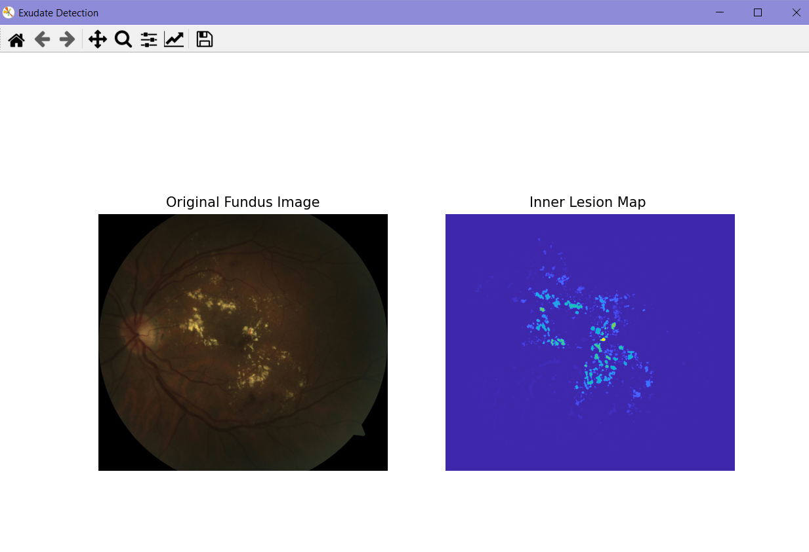
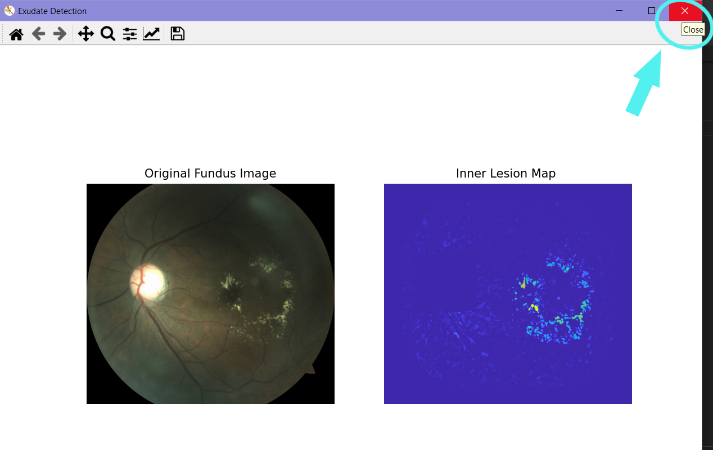

## About The Project



Using The Hamilton Eye Institute Macular Edema Dataset (HEI-MED). We aim to detect exudates -type of bright lesions- in fundus images, through applying lesion segmentation and color analysis. 

### Here's why:
* Diabetic macular edema (DME) is a complication of Diabetic retinopathy (DR).
* It is a vision threatenining condition for diabetes patients.
* Early Diagnosis can prevent complete vision loss by providing early treatment.

&nbsp;
### Built With

* [Python](https://www.python.org/)
* [Matplotlib](https://matplotlib.org/)
* [OpenCV](https://opencv.org/)
* [scikit-image](https://scikit-image.org/)
* [NumPy](https://numpy.org/)
* [SciPy](https://scipy.org/)  


&nbsp;

## Getting Started

### Prerequisites

You need to install these libraries:
* pip
  ```sh
  pip install matplotlib
  pip install opencv-python
  pip install scikit-image
  pip install numpy
  pip install scipy
  pip install keyboard
  ```

### Installation

1. Clone the repo
   ```sh
   git clone https://github.com/samarnabil/Exudate-Detection.git
   ```
3. Install pip packages - mentioned in the above prerequisite section.

&nbsp;
## Usage

1. Open the project with your editor of choice.
2. Run [tesy.py](test.py)
3. Wait for the figure window.
4. Press 'close' key to proceed to next image.
    
5. To quit the program, press 'q'.
    

&nbsp;
## The following methods are available


&nbsp;
## Contact

* Samar Nabil - samarnabil22@gmail.com 
* Yomna Sabah - 
* Menna Kamel

Project Link: [https://github.com/samarnabil/Exudate-Detection](https://github.com/samarnabil/Exudate-Detection)


&nbsp;
## Acknowledgments

* [Giancardo, L.; Meriaudeau, F.; Karnowski, T. P.; Li, Y.; Garg, S.; Tobin, Jr, K. W.; Chaum, E. (2012), 'Exudate-based diabetic macular edema detection in fundus images using publicly available datasets.', Medical Image Analysis 16(1), 216--226.](https://www.sciencedirect.com/science/article/abs/pii/S1361841511001010?via%3Dihub)

